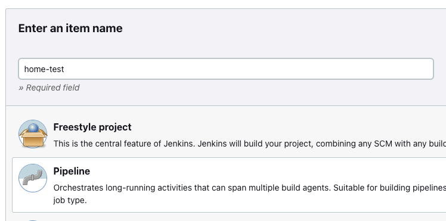
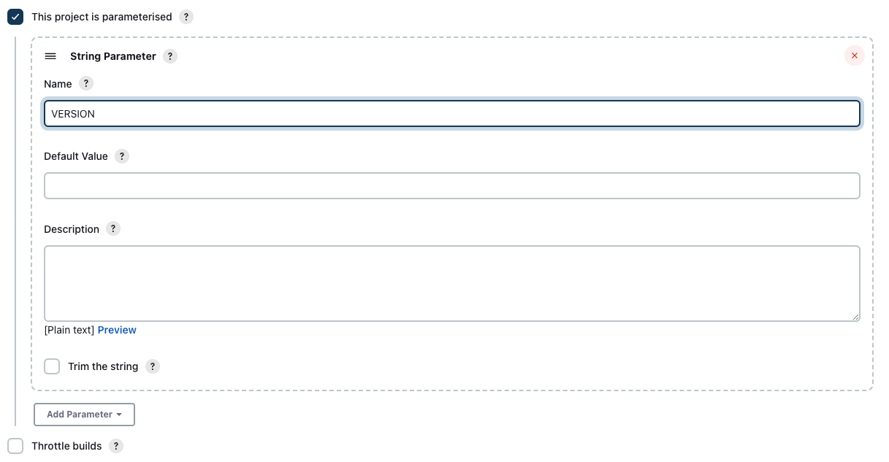
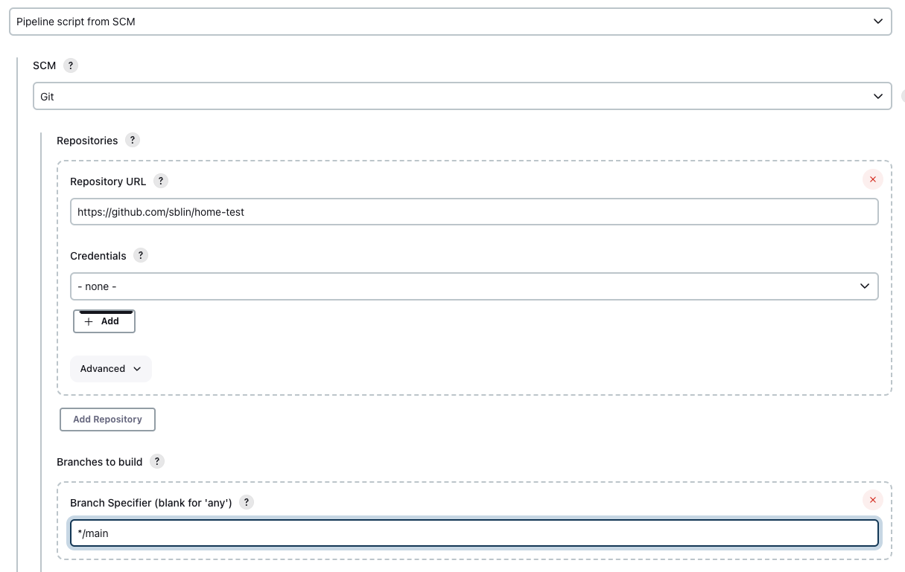
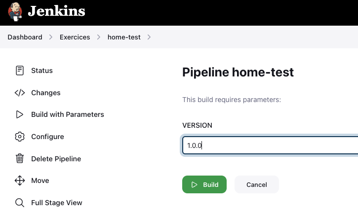
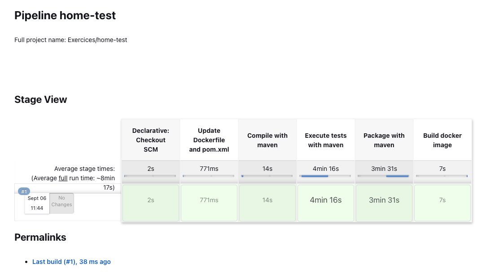
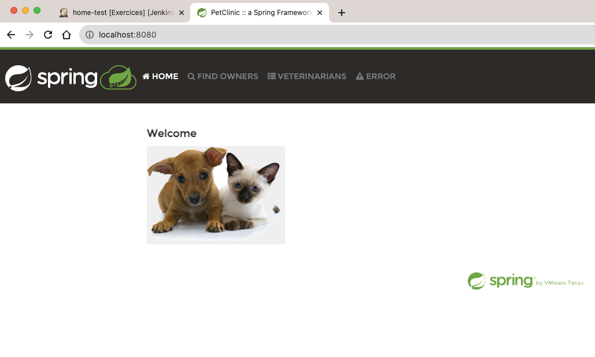

# Simple integration of the spring-petclinic application with jenkins

This repository is a copy of the [spring-petclinic](https://github.com/spring-projects/spring-petclinic) repository.
 
Objective: expose how to use a Jenkins pipeline to compile and package the spring-petclinic application into a docker image.

## Description
The project has been modified like below:
- the `pom.xml`has been modified with an artifact version set as `{{VERSION}}`. It's a placeholder that will be replaced during the execution of the Jenkins pipeline.
- new file `Jenkinfile`: the file is the definition of the Jenkins pipeline.
The pipeline contains 5 steps that are self explicit:
    - step 1: replaces the placeholder in the pom.xml and Dockerfile files
    - steps 2,3,4: common maven goals to build the artifact
    - step 5: build the docker image using the `Dockerfile` file. The resulted image is named 'hometest:{{VERSION}}' 
- new file `Dockerfile`: the file defines how to build the new image and is used in step 5 of the pipeline


## Prerequisites

1. Local machine is a linux based machine
2. Docker installed and running on the local machine (docker command available as `/usr/local/bin/docker` )
3. Java SDK 17 installed on the local machine
4. Jenkins installed and running on the local machine
5. `/usr/bin/sed` command available on the local machine
6. Git command available on the local machine


## Running petclinic locally
Petclinic is a [Spring Boot](https://spring.io/guides/gs/spring-boot) application built using [Maven](https://spring.io/guides/gs/maven/) or [Gradle](https://spring.io/guides/gs/gradle/). 

In this project maven is used to build the application.

### Step 1: clone the repository

```
git clone git@github.com:sblin/home-test.git
```


### Step 2: Create a new Jenkins project

- using the Jenkins UI create a new Pipeline project


- add a parameter for the project (check `This project is parameterised` and add a String parameter named `VERSION`)


- set the SCM configuration as below:



If all the prerequisites are okay, you're all done!   

### Step 3: Run the pipeline

Click on "Build with parameters" and set the version.


The pipeline is started and the different steps executed. If all the prerequisites are okay, the pipeline should execute without any errors in a few minutes.



### Step 4: Run the application

The new image is available locally:
```
➜  ~ docker images | grep hometest
hometest                                       1.0.0             fa450e8c0ec3   About a minute ago   466MB
```

Start a container:
```
docker run -p 8080:8080 hometest:1.0.0
```

The application is available at http://localhost:8080!

